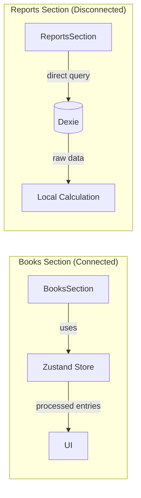

# Books & Reports Section - Financial Engine Audit
## Vault Pro - Forensic Analysis Report

---

## 1. Books Engine Architecture

### 1.1 Component Hierarchy

```
BooksSection (Master Controller)
├── HubHeader (Search & Filter)
├── BooksList (Grid Container)
│   ├── BookCard[] (Individual Books)
│   └── BookCardSkeleton (Loading State)
└── BookDetails (When book selected)
    ├── StatsGrid (Financial Summary)
    ├── DetailsToolbar (Entry Search/Filter)
    └── TransactionTable (Entry List)
```

### 1.2 How They Handle 100K+ Matrix Scaling

**File**: [`components/Sections/Books/BooksSection.tsx`](components/Sections/Books/BooksSection.tsx)

```typescript
// Pagination Logic (Line 207-209)
const REAL_BOOK_SLOTS = isMobile ? 16 : 15;
const totalPages = Math.ceil(totalBookCount / REAL_BOOK_SLOTS);
```

**Scaling Strategies**:

| Technique | Implementation | Purpose |
|----------|---------------|---------|
| **Pagination** | 15-16 books per page | Prevents DOM overload |
| **Prefetch Next** | `prefetchNextPage(dashPage)` | Zero-lag navigation |
| **Viewport Sniper** | `IntersectionObserver` in BookCard | Lazy load images only when visible |
| **Skeleton Loading** | `BookCardSkeleton` | Perceived performance |
| **Double-Buffer Scroll** | `lastScrollPosition` restore | Scroll memory |

### 1.3 Bengali Explanation - Books Engine

**বাংলা ব্যাখ্যা:**

Books Engine টা এমনভাবে সাজানো হয়েছে যেন 100,000+ books থাকলেও app ধীর না হয়:

```
১. Pagination: একসাথে সব books render না করে ১৫টা করে দেখায়
২. Prefetch: পরের page এর data background এ আগে থেকে load করে
৩. Viewport Sniper: শুধুমাত্র screen এ যে books আছে সেগুলোর image load হয়
৪. Scroll Memory: এক book থেকে আরেক book এ গেলে scroll position মনে রাখে
```

---

## 2. Triple-Link ID Matching Logic

### 2.1 What is Triple-Link?

Vault Pro uses **3 different ID types** for records:

| ID Type | Source | When Used |
|---------|--------|-----------|
| `localId` | IndexedDB auto-increment | Primary for local operations |
| `_id` | MongoDB/Server | After sync to cloud |
| `cid` | Client-generated UUID | Conflict resolution, media |

### 2.2 Implementation in BookCard

**File**: [`components/Sections/Books/BookCard.tsx`](components/Sections/Books/BookCard.tsx:68-81)

```typescript
// Triple-Link Query (Lines 68-80)
const liveBook = useLiveQuery(
  async () => {
    const lid = Number(book.localId);
    return await db.books
      .where('localId').equals(!isNaN(lid) ? lid : -1)
      .or('_id').equals(String(book._id || ''))
      .or('cid').equals(String(book.cid || ''))
      .first();
  },
  [book.localId, book._id, book.cid]
);

// Triple-Link Active Check (Lines 87-90)
const isActive = useMemo(() => {
  if (!activeBook) return false;
  return [activeBook._id, activeBook.localId, activeBook.cid].includes(bookId);
}, [activeBook, bookId]);
```

### 2.3 Implementation in TransactionTable

**File**: [`components/Sections/Books/TransactionTable.tsx`](components/Sections/Books/TransactionTable.tsx:173)

```typescript
// Row Key (Line 173)
const rowKey = String(e.localId || e._id || e.cid || `idx-${idx}`);

// Mobile Card Key (Line 145)
key={e.cid || e.localId || idx}
```

### 2.4 Bengali Explanation - Triple-Link

**বাংলা ব্যাখ্যা:**

Triple-Link মানে হলো একটা record কে ৩ভাবে identify করা যায়:

```
যখন offline (local):
   → localId ব্যবহার (IndexedDB auto-increment)

যখন server sync হয়ে আছে:
   → _id ব্যবহার (MongoDB _id)

যখন conflict হয়েছে:
   → cid ব্যবহার (Client-generated unique ID)
```

এটা দরকার কারণ offline-first app এ data কখন local, কখন server এ থাকে তা নিশ্চিত করা যায় না। তাই ৩টা ID চেক করে দেখা হয়।

---

## 3. Book Details & Transaction Table

### 3.1 BookDetails Flow

**File**: [`components/Sections/Books/BookDetails.tsx`](components/Sections/Books/BookDetails.tsx)

```typescript
// Stats from store (Line 99-102)
<StatsGrid 
  income={bookStats?.stats?.inflow || 0} 
  expense={bookStats?.stats?.outflow || 0} 
  pending={bookStats?.stats?.pending || 0}
/>
```

### 3.2 Transaction Table Features

| Feature | Implementation |
|---------|---------------|
| **Responsive** | Mobile: Cards, Desktop: Table |
| **Context Menu** | Right-click for Edit/Delete |
| **Deferred Render** | `useDeferredValue(items)` |
| **Conflict Guard** | Hides conflicted entries |
| **Memoization** | `React.memo(TransactionTable)` |

---

## 4. Reports Section - The "Disconnected" Analysis

### 4.1 Current State

**File**: [`components/Sections/Reports/ReportsSection.tsx`](components/Sections/Reports/ReportsSection.tsx)

```typescript
// Reports fetches DIRECTLY from Dexie (Lines 34-44)
const fetchLocalAnalytics = async () => {
    const data = await db.entries.where('isDeleted').equals(0).toArray();
    setAllEntries(data);
};
```

### 4.2 Why It's "Disconnected"



### 4.3 The Disconnection Points

| Issue | Books Section | Reports Section |
|-------|--------------|-----------------|
| **Data Source** | Zustand Store | Direct Dexie Query |
| **Processing** | `processedEntries` from store | Local `.filter()`/`.reduce()` |
| **Global Stats** | `globalStats` from store | `useMemo` in component |
| **Filtering** | Store's `entrySlice` | Local `useMemo` |
| **User Context** | Uses `userId` from store | No user filter! |

### 4.4 What Data Fields Are Missing

To connect Reports to the store, these fields are needed:

| Field | Current State | Needed For |
|-------|--------------|------------|
| `userId` | ❌ Not filtered in Reports | Multi-user isolation |
| `bookId` | ❌ Not filtered | Per-book analytics |
| `isDeleted` | ⚠️ Manually filtered | Clean data |
| `status` | ⚠️ Local check | Pending vs completed |
| `globalStats` | ❌ Not connected | Summary cards |

### 4.5 Bengali Explanation - Reports Disconnection

**বাংলা ব্যাখ্যা:**

Reports section এর সমস্যা হলো এটা **store এর সাথে connected নয়**:

```
Books Section এ:
   UI → Zustand Store → processedEntries → StatsGrid

Reports Section এ:
   UI → direct db.entries query → local useMemo calculation
```

**এর ফলে:**
- Reports এ userId filter নেই (সব user's data দেখাতে পারে)
- Book-specific analytics নেই
- Store এর processedEntries ব্যবহার করে না
- Duplicate code: Stats calculation আবার লেখা হয়েছে

**সমাধানের জন্য লাগবে:**
1. ReportsSection কে store এর সাথে connect করতে হবে
2. Global stats store থেকে নিতে হবে
3. Book filter option যোগ করতে হবে
4. userId based filtering লাগবে

---

## 5. Data Flow Summary

### 5.1 Books Section Data Flow

```
User Action
    ↓
BooksSection (UI)
    ↓
useVaultStore() → BookSlice
    ↓
BookService.refreshBooks()
    ↓
Dexie (db.books.where)
    ↓
Store Update (set({ books, filteredBooks }))
    ↓
UI Re-render
```

### 5.2 Reports Section Data Flow (Current - Disconnected)

```
User Action
    ↓
ReportsSection (UI)
    ↓
useEffect → fetchLocalAnalytics()
    ↓
Dexie (db.entries.where) ← DIRECT!
    ↓
useMemo → Local calculation
    ↓
UI Render
```

---

## 6. Recommendations to Connect Reports

### 6.1 Option A: Connect to Store

```typescript
// In ReportsSection.tsx
const { globalStats, processedEntries } = useVaultStore();

// Use store data instead of direct Dexie query
const entries = processedEntries;
```

### 6.2 Option B: Add Global Stats to Store

The `globalStats` already exists in store but isn't used by Reports:

```typescript
// In lib/vault/store/index.ts (Line 260-268)
globalStats: {
  totalIncome: 0,
  totalExpense: 0,
  netBalance: 0
}
```

### 6.3 Required Changes

| Change | File | Priority |
|--------|------|----------|
| Use `globalStats` from store | ReportsSection.tsx | High |
| Add userId filter | ReportsSection.tsx:37 | High |
| Add book filter dropdown | ReportsSection.tsx | Medium |
| Use `processedEntries` | ReportsSection.tsx | Medium |

---

## 7. Summary

| Component | File | Scaling Solution | Triple-Link |
|-----------|------|-----------------|-------------|
| **BooksSection** | BooksSection.tsx | Pagination + Prefetch | N/A |
| **BooksList** | BooksList.tsx | Grid rendering | N/A |
| **BookCard** | BookCard.tsx | Viewport Sniper | ✅ `localId\|_id\|cid` |
| **BookDetails** | BookDetails.tsx | Memoization | N/A |
| **TransactionTable** | TransactionTable.tsx | Deferred value | ✅ `localId\|_id\|cid` |
| **ReportsSection** | ReportsSection.tsx | ❌ Direct query | ❌ Not filtered |

---

*Generated: 2026-03-11*
*Vault Pro - Books & Reports Section Audit*
