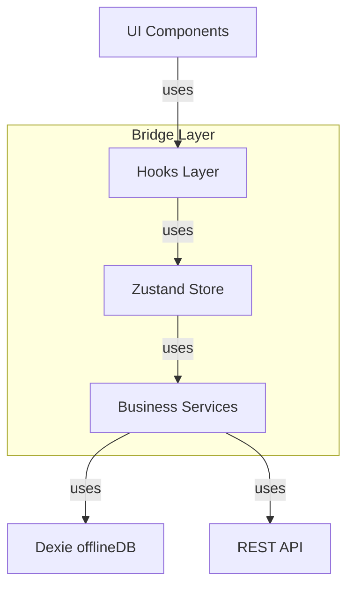
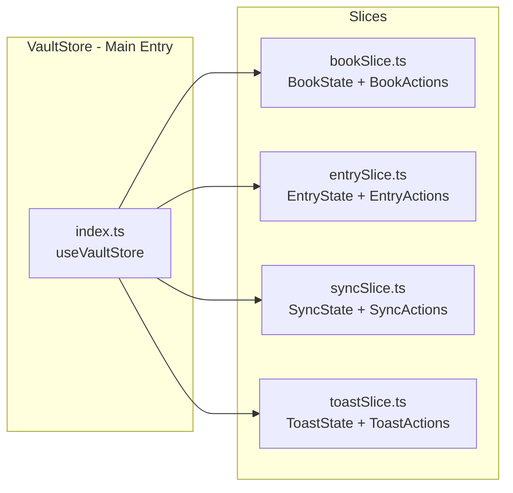
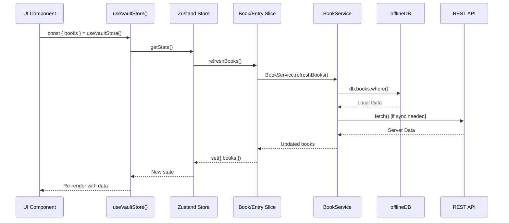
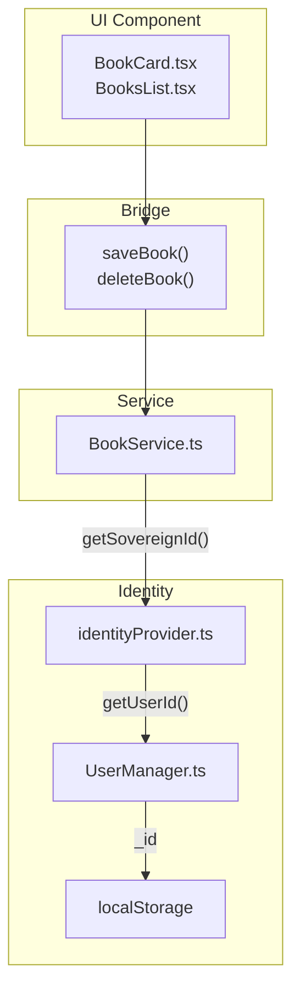

# Frontend Infrastructure & Bridge Layer Audit
## Vault Pro - Forensic Analysis Report

---

## 1. Executive Summary

This document provides a forensic audit of the Frontend Ecosystem, specifically identifying the **"Bridge Layer"** — the middleware files that act as intermediaries between the UI components and the Backend/Dexie (IndexedDB) database.

---

## 2. Bridge Layer Architecture

The Bridge Layer consists of three main categories:



---

## 3. Identified Bridges: Hooks

### 3.1 Data & State Hooks

| Hook | File | Responsibility |
|------|------|----------------|
| `useVaultStore` | [`lib/vault/store/index.ts`](lib/vault/store/index.ts) | Main Zustand store - provides all app state |
| `useVaultState` | [`lib/vault/store/storeHelper.ts`](lib/vault/store/storeHelper.ts:26) | Returns full store state for components |
| `useBootStatus` | [`lib/vault/store/storeHelper.ts`](lib/vault/store/storeHelper.ts:7) | Returns boot status (`IDLE`, `INITIALIZING`, `READY`) |
| `useInteractionGuard` | [`lib/vault/store/storeHelper.ts`](lib/vault/store/storeHelper.ts:17) | Manages overlay interaction blocking |
| `useProfile` | [`hooks/useProfile.ts`](hooks/useProfile.ts) | User profile management |
| `useSettings` | [`hooks/useSettings.ts`](hooks/useSettings.ts) | Theme and user preferences |

### 3.2 UI & Animation Hooks

| Hook | File | Responsibility |
|------|------|----------------|
| `useTranslation` | [`hooks/useTranslation.ts`](hooks/useTranslation.ts) | i18n translation access |
| `useThemeTransition` | [`hooks/useThemeTransition.ts`](hooks/useThemeTransition.ts) | Oil/liquid theme animation |
| `useSafeAction` | [`hooks/useSafeAction.ts`](hooks/useSafeAction.ts) | Safe async action execution |
| `useAnimationSync` | [`hooks/useAnimationSync.ts`](hooks/useAnimationSync.ts) | Animation synchronization |
| `useBookImage` | [`hooks/useBookImage.ts`](hooks/useBookImage.ts) | Book image handling |
| `useLocalPreview` | [`hooks/useLocalPreview.ts`](hooks/useLocalPreview.ts) | Local media preview |
| `useNativeNavigation` | [`hooks/useNativeNavigation.ts`](hooks/useNativeNavigation.ts) | Mobile navigation |
| `useGuidance` | [`hooks/useGuidance.ts`](hooks/useGuidance.ts) | Onboarding guidance |

---

## 4. Identified Bridges: Zustand Store (lib/vault/store)

### 4.1 Store Structure



### 4.2 State Slices

| Slice | File | Responsibility |
|-------|------|----------------|
| **BookSlice** | [`lib/vault/store/slices/bookSlice.ts`](lib/vault/store/slices/bookSlice.ts) | Book CRUD, search, sort, pagination, matrix management |
| **EntrySlice** | [`lib/vault/store/slices/entrySlice.ts`](lib/vault/store/slices/entrySlice.ts) | Entry CRUD, filtering |
| **SyncSlice** | [`lib/vault/store/slices/syncSlice.ts`](lib/vault/store/slices/syncSlice.ts) | Sync status, conflict management |
| **ToastSlice** | [`lib/vault/store/slices/toastSlice.ts`](lib/vault/store/slices/toastSlice.ts) | Toast notifications |

### 4.3 Store Access Patterns

Components access the store via:
1. **Hook Pattern**: `const { books, activeBook } = useVaultStore()`
2. **Helper Pattern**: `const store = useVaultState()` from [`storeHelper.ts`](lib/vault/store/storeHelper.ts)
3. **Static Pattern**: `getVaultStore()` for non-hook contexts

---

## 5. State Flow (Bengali Explanation)

### 5.1 Zustand Store থেকে Components Connection

```
Components → useVaultStore() Hook → Zustand Store (lib/vault/store/index.ts)
```

**বাংলা ব্যাখ্যা:**

1. **UI Component** (যেমন `BookCard.tsx`) যখন data দেখাতে চায়, তখন `useVaultStore()` hook call করে।

2. **Hook** Zustand-এর `create()` function থেকে state return করে।

3. **Store** বিভিন্ন **Slices** (bookSlice, entrySlice, syncSlice, toastSlice) combine করে তৈরি।

4. **Slice-গুলো** নিজ নিজ **Service** (BookService, EntryService) call করে।

5. **Service** গুলো **Dexie** (offlineDB) অথবা **REST API** থেকে data fetch করে।

6. **Dexie** হলো IndexedDB-র wrapper - এখনে সব offline data store হয়।

### 5.2 Data Flow Diagram



---

## 6. Identity Handshake: getSovereignId() Trace

### 6.1 Source: IdentityProvider

**File**: [`lib/utils/identityProvider.ts`](lib/utils/identityProvider.ts)

```typescript
static async getSovereignId(): Promise<string | null> {
  // Returns user ID from UserManager or localStorage
}
```

### 6.2 Usage Chain



### 6.3 Files Using getSovereignId()

| File | Usage |
|------|-------|
| [`lib/vault/services/BookService.ts`](lib/vault/services/BookService.ts:83) | Create/Update/Delete operations |
| [`lib/vault/services/PullService.ts`](lib/vault/services/PullService.ts:258) | Sync operations |
| [`lib/vault/hydration/HydrationController.ts`](lib/vault/hydration/HydrationController.ts:696) | Data hydration |

### 6.4 Identity Flow (Bengali)

```
UI Component → BookService.saveBook() 
  → getSovereignId() 
    → IdentityProvider.getSovereignId() 
      → UserManager.getInstance().getUserId() 
        → localStorage.getItem('vault_user')
```

**বাংলা ব্যাখ্যা:** 

সব mutation operation-এর আগে `getSovereignId()` call করা হয়। এটি নিশ্চিত করে যে শুধুমাত্র authenticated user-ই data modify করতে পারে।

---

## 7. Non-UI Frontend Files List

### 7.1 Core Infrastructure

| File | Responsibility |
|------|----------------|
| [`lib/offlineDB.ts`](lib/offlineDB.ts) | Dexie database configuration (V38) - Tables: books, entries, users, telemetry, audits, mediaStore |
| [`lib/db.ts`](lib/db.ts) | Database initialization wrapper |
| [`lib/vault/store/index.ts`](lib/vault/store/index.ts) | Main Zustand store with secure persistence |
| [`lib/vault/store/storeHelper.ts`](lib/vault/store/storeHelper.ts) | Store access helpers |

### 7.2 Services (Business Logic)

| File | Responsibility |
|------|----------------|
| [`lib/vault/services/BookService.ts`](lib/vault/services/BookService.ts) | Book CRUD, matrix management, pagination |
| [`lib/vault/services/FinanceService.ts`](lib/vault/services/FinanceService.ts) | Balance calculation, stats |
| [`lib/vault/services/PullService.ts`](lib/vault/services/PullService.ts) | Server-to-client sync |
| [`lib/vault/services/PushService.ts`](lib/vault/services/PushService.ts) | Client-to-server sync |
| [`lib/vault/services/ConflictService.ts`](lib/vault/services/ConflictService.ts) | Conflict detection & resolution |
| [`lib/vault/services/IntegrityService.ts`](lib/vault/services/IntegrityService.ts) | Data integrity checks |
| [`lib/vault/services/MaintenanceService.ts`](lib/vault/services/MaintenanceService.ts) | App maintenance tasks |

### 7.3 Utilities

| File | Responsibility |
|------|----------------|
| [`lib/utils/identityProvider.ts`](lib/utils/identityProvider.ts) | Sovereign identity management |
| [`lib/utils/helpers.ts`](lib/utils/helpers.ts) | General helpers (cn, formatCurrency) |
| [`lib/utils/mediaProcessor.ts`](lib/utils/mediaProcessor.ts) | Image/media processing |
| [`lib/utils/deviceUtils.ts`](lib/utils/deviceUtils.ts) | Device detection |
| [`lib/utils/security.ts`](lib/vault/utils/security.ts) | Security utilities |

### 7.4 Core Systems

| File | Responsibility |
|------|----------------|
| [`lib/vault/core/user/UserManager.ts`](lib/vault/core/user/UserManager.ts) | User identity singleton |
| [`lib/vault/core/SyncOrchestrator.ts`](lib/vault/core/SyncOrchestrator.ts) | Sync coordination |
| [`lib/vault/core/RealtimeEngine.ts`](lib/vault/core/RealtimeEngine.ts) | Real-time updates (Pusher) |
| [`lib/vault/hydration/HydrationController.ts`](lib/vault/hydration/HydrationController.ts) | Data hydration from server |
| [`lib/vault/hydration/engine/HydrationEngine.ts`](lib/vault/hydration/engine/HydrationEngine.ts) | Hydration logic |

### 7.5 Security & Guards

| File | Responsibility |
|------|----------------|
| [`lib/vault/guards/SyncGuard.ts`](lib/vault/guards/SyncGuard.ts) | Sync state guards |
| [`lib/vault/store/sessionGuard.ts`](lib/vault/store/sessionGuard.ts) | Session management |
| [`lib/vault/security/LicenseVault.ts`](lib/vault/security/LicenseVault.ts) | License verification |
| [`lib/vault/security/RiskManager.ts`](lib/vault/security/RiskManager.ts) | Risk assessment |

### 7.6 Context Providers

| File | Responsibility |
|------|----------------|
| [`context/ModalContext.tsx`](context/ModalContext.tsx) | Modal state management |
| [`context/PusherContext.tsx`](context/PusherContext.tsx) | Real-time Pusher connection |
| [`context/TranslationContext.tsx`](context/TranslationContext.tsx) | i18n provider |

---

## 8. Summary: Bridge Layer Responsibilities

| Layer | Files | Responsibility |
|-------|-------|----------------|
| **Hooks** | useVaultStore, useProfile, useSettings, useTranslation | Expose store state & actions to UI |
| **Store** | lib/vault/store/* | Central state management, persistence |
| **Slices** | bookSlice, entrySlice, syncSlice | Domain-specific state logic |
| **Services** | BookService, FinanceService, PullService, PushService | Business logic, Dexie/API interaction |
| **Identity** | identityProvider.ts, UserManager.ts | User authentication anchor |
| **Dexie** | offlineDB.ts | Offline-first data persistence |

---

## 9. Conclusion

The **Bridge Layer** is the critical middleware that:

1. **Decouples UI** from data sources (Dexie & REST API)
2. **Provides reactive state** via Zustand
3. **Enforces security** via IdentityProvider.getSovereignId()
4. **Enables offline-first** via Dexie with sync to cloud

This architecture follows the **PROJECT DNA V4.0** mandates:
- ✅ Sovereign Identity via IdentityProvider
- ✅ Timestamp Absolutism (Unix MS)
- ✅ Atomic Batching via HydrationController
- ✅ Recall Over Incremental (Dexie as source of truth)

---

*Generated: 2026-03-11*
*Vault Pro - Frontend Infrastructure Audit*
