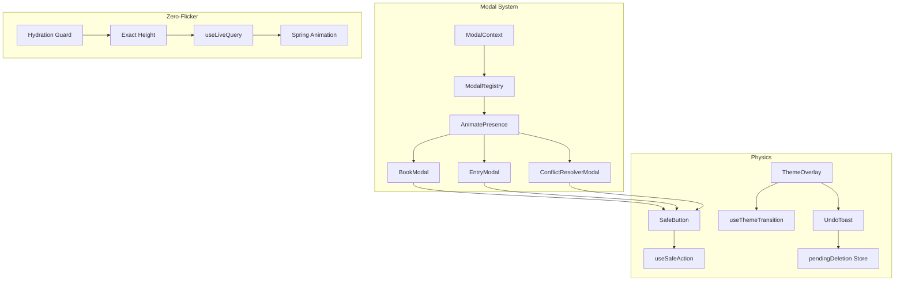

# INTERACTION AND MODALS - মোডালস ও ইউআই ফিজিক্স

## ১. মোডাল পোর্টাল সিস্টেম

### ১.১ ModalPortal.tsx - বডি পোর্টালাইজেশন

```typescript
// ModalPortal.tsx - React Portal ব্যবহার করে মডালকে body-তে রেন্ডার করে
export const ModalPortal = ({ children }) => {
  const [mounted, setMounted] = useState(false);

  useEffect(() => {
    setMounted(true);
    return () => setMounted(false);
  }, []);

  // হাইড্রেশন এরর প্রিভেন্ট করে
  return mounted ? createPortal(children, document.body) : null;
};
```

**কাজ:** মডাল কম্পোনেন্টকে DOM-এর মূল বডির শেষে রেন্ডার করে, যাতে z-index কনফ্লিক্ট না হয়।

### ১.২ ModalContext.tsx - গ্লোবাল স্টেট ম্যানেজমেন্ট

```typescript
// ModalContext.tsx - কেন্দ্রীয় মডাল স্টেট
const openModal = useCallback((targetView: ModalView, modalData) => {
    setData(modalData);
    setView(targetView);
    setIsOpen(true);
    registerOverlay('Modal'); // Vault store-তে রেজিস্টার
    
    // Browser history push করে
    window.history.pushState({ modalView: targetView }, `#modal-${targetView}`);
}, []);

const closeModal = useCallback(() => {
    setIsOpen(false);
    setView('none');
    setData(null);
    unregisterOverlay('Modal');
}, []);
```

**মডাল টাইপস:**
| টাইপ | ব্যবহার |
|------|----------|
| `addBook` / `editBook` | বুক ক্রিয়েশন/এডিট |
| `addEntry` / `editEntry` | এন্ট্রি ক্রিয়েশন/এডিট |
| `analytics` | চার্ট ভিউ |
| `export` | এক্সপোর্ট মডাল |
| `share` | শেয়ারিং |
| `conflictResolver` | সিঙ্ক কনফ্লিক্ট রিজলভার |
| `deleteConfirm` | ডিলিট কনফার্মেশন |

### ১.৩ ModalRegistry.tsx - মডাল রেজিস্ট্রি

```typescript
// ModalRegistry.tsx - AnimatePresence দিয়ে মডাল শো/হাইড
<AnimatePresence mode="popLayout">
  {view === 'addBook' && <BookModal key="book-modal" />}
  {view === 'addEntry' && <EntryModal key="entry-modal" />}
  {view === 'conflictResolver' && <ConflictResolverModal />}
  {/* ... অন্যান্য মডাল */}
</AnimatePresence>
```

---

## ২. মিউটেশন মোডালস - ভ্যালিডেশন লজিক

### ২.১ BookModal.tsx - বুক ক্রিয়েশন

**ফিচারস:**
- **Instant Local Preview** - ইমেজ সিলেক্ট করলে তাৎক্ষণিক প্রিভিউ
- **Type Selector** - general / customer / supplier
- **Enter Key Support** - কিবোর্ড শর্টকাট
- **Auto-focus** - মডাল ওপেন হলে নাম ফিল্ডে অটো-ফোকাস

**ভ্যালিডেশন:**
```typescript
// BookModal.tsx:107 - মিনিমাম ভ্যালিডেশন
if (isLoading || !form.name.trim()) return;

// ক্লিন পেলোড তৈরি
const cleanPayload = {
    name: form.name.trim(),
    type: form.type,
    description: form.description.trim() || "",
    phone: form.type !== 'general' ? form.phone.trim() : "",
    image: form.image || ""
};

const result = await saveBook(cleanPayload, initialData);
```

**⚠️ Note:** Zod ব্যবহার করে না - ম্যানুয়াল ভ্যালিডেশন।

### ২.২ EntryModal.tsx - এন্ট্রি ক্রিয়েশন

**স্মার্ট ফিচারস:**

| ফিচার | কোড লোকেশন | বিবরণ |
|--------|------------|--------|
| **Duplicate Shield** | Line 83-96 | ১০ মিনিটের মধ্যে একই অ্যামাউন্ট হলে ওয়ার্নিং |
| **Safe Math Engine** | Line 27-32 | Bengali to English কনভার্সন |
| **Auto-Pilot** | Line 56-81 | ডিভাইস ডিটেকশন, কীপ্যাড অটো-শো |
| **Precision Fix** | Line 99 | ফাইন্যান্সিয়াল প্রিসিশন ফিক্স |

```typescript
// EntryModal.tsx - Duplicate Detection
useEffect(() => {
    const check = async () => {
        const amt = safeCalculate(convertBanglaToEnglish(amountStr));
        if (amt <= 0) return setShowDuplicate(false);
        
        // ১০ মিনিটের মধ্যে একই বুকে একই অ্যামাউন্ট চেক
        const exists = await db.entries.where('userId').equals(userId).and((entry) => 
            entry.bookId === bookId && 
            entry.amount === amt && 
            (Date.now() - entry.createdAt < 600000)
        ).count();
        setShowDuplicate(exists > 0);
    };
    const timer = setTimeout(check, 500);
    return () => clearTimeout(timer);
}, [amountStr]);
```

**DNA হার্ডেনিং:**
```typescript
// EntryModal.tsx:137 - তারিখ কনভার্সন
date: form.date ? (
    typeof form.date === 'number' 
        ? form.date 
        : new Date(form.date).getTime()
) : Date.now(),
```

---

## ৩. Conflict Resolver - সাইড-বাই-সাইড ডাটা

### ৩.১ ConflictResolverModal.tsx

**দুটি কনফ্লিক্ট টাইপ:**

| টাইপ | বিবরণ | অ্যাকশন |
|------|-------|----------|
| `version` | ভার্সন মিসম্যাচ | Local বা Server রাখুন |
| `parent_deleted` | প্যারেন্ট বুক ডিলিটেড | রিস্টোর বা কনফার্ম |

```typescript
// ConflictResolverModal.tsx:65-100
const handleResolution = async (resolution: 'local' | 'server') => {
    // parent_deleted কেসে বিশেষ হ্যান্ডলিং
    if (conflictType === 'parent_deleted' && resolution === 'local') {
        const { resurrectBookChain } = getVaultStore();
        await resurrectBookChain(record.cid); // সম্পূর্ণ রিসারেকশন
        onClose();
        return;
    }
    
    // নরমাল কনফ্লিক্ট রিজলভ
    registerConflict({ id: record.cid, type, record });
    onResolve(resolution);
};
```

**সাইড-বাই-সাইড ডিসপ্লে:**

```typescript
// বাম পাশে - Local Version
<div className="bg-blue-500/10 border-blue-500/20">
    <h3>Your Version</h3>
    <p>Local changes</p>
    {/* ফিল্ডস: name, phone, type, amount, status, description */}
</div>

// ডান পাশে - Server Version  
<div className="bg-green-500/10 border-green-500/20">
    <h3>Server Version</h3>
    <p>Cloud data</p>
    {/* একই ফিল্ডস */}
</div>
```

---

## ৪. UI অ্যাটমস - ফিজিক্স অ্যান্ড অ্যানিমেশন

### ৪.১ SafeButton.tsx - এলিট বাটন ফিজিক্স

**ফিচারস:**
- **Double-Click Prevention** - useSafeAction হুক ইন্টিগ্রেশন
- **Loading State** - লোডিং স্পিনার
- **Blocked State** - সিস্টেম বাসি হলে শেক অ্যানিমেশন
- **Error State** - এরর শো

```typescript
// SafeButton.tsx - শেক ভ্যারিয়েন্ট
const shakeVariants = {
    idle: { x: 0 },
    shake: {
        x: [0, -4, 4, -4, 4, -2, 2, 0],
        transition: { duration: 0.5, ease: "easeInOut" }
    }
};

// পালস ভ্যারিয়েন্ট
const pulseVariants = {
    idle: { opacity: 1 },
    pulse: {
        opacity: [1, 0.7, 1],
        transition: { duration: 1.5, repeat: Infinity }
    }
};

// অ্যানিমেশন অ্যাপ্লিকেশন
<motion.button
    variants={actionState === 'blocked' ? shakeVariants : undefined}
    animate={
        actionState === 'blocked' ? 'shake' :
        actionState === 'loading' ? 'pulse' : 'idle'
    }
    whileHover={{ scale: 1.02 }}
    whileTap={{ scale: 0.98 }}
>
```

### ৪.২ ThemeOverlay.tsx - টেলিগ্রাম ট্রানজিশন

**"তেল গড়িয়ে পড়া" ইফেক্ট:**

```typescript
// ThemeOverlay.tsx - গ্র্যাভিটি-ড্রিভেন লিকুইড ভ্যারিয়েন্ট
const liquidVariants = {
    initial: {
        clipPath: transitionDirection === 'expand' 
            ? `circle(0% at ${x}px ${y}px)` 
            : `ellipse(250% 250% at ${x}px ${y + 500}px)`,
        opacity: 0,
    },
    animate: {
        clipPath: transitionDirection === 'expand'
            ? `ellipse(200% 250% at ${x}px ${y + 800}px)` // মাধ্যাকর্ষণ টানে নিচে
            : `circle(0% at ${x}px ${y}px)`,
        opacity: 1,
    }
};

// ট্রানজিশন কনফিগ
transition={{
    duration: 4, // ৪ সেকেন্ড
    ease: [0.8, 0, 0.1, 1], // viscous easing
}}
```

**লজিক:**
1. ডার্ক মোডে → তেল নিচে গড়িয়ে পড়ে (expand)
2. লাইট মোডে → তেল ফিরে যায় (contract)

### ৪.৩ UndoToast.tsx - ৮ সেকেন্ড ডিলেটেড ডিলিট

```typescript
// UndoToast.tsx - কাউন্টডাউন প্রগ্রেস বার
const UndoToast = () => {
    const { pendingDeletion, cancelDeletion } = useVaultStore();
    const [remainingTime, setRemainingTime] = useState(0);

    useEffect(() => {
        const interval = setInterval(() => {
            const remaining = Math.max(0, Math.ceil((expiresAt - now) / 1000));
            setRemainingTime(remaining);
            if (remaining === 0) clearInterval(interval);
        }, 100);
        return () => clearInterval(interval);
    }, [pendingDeletion]);

    const progress = (remainingTime / 8) * 100;

    return (
        <motion.div
            initial={{ opacity: 0, y: 50, scale: 0.8 }}
            animate={{ opacity: 1, y: 0, scale: 1 }}
            transition={{ type: "spring", stiffness: 400, damping: 30 }}
        >
            {/* প্রগ্রেস বার */}
            <div className="h-2 bg-yellow-500/20 rounded-full">
                <motion.div 
                    className="h-full bg-yellow-500"
                    animate={{ width: `${progress}%` }}
                />
            </div>
            
            <button onClick={cancelDeletion}>
                <RotateCcw /> Undo Deletion
            </button>
        </motion.div>
    );
};
```

---

## ৫. জিরো-ফ্লিকার অভিজ্ঞতা

### কীভাবে ফ্লিকার প্রিভেন্ট করা হয়:

| টেকনিক | ইমপ্লিমেন্টেশন |
|---------|-----------------|
| **Hydration Guard** | `isMounted` চেক পরে রেন্ডার |
| **Exact Height** | স্কেলেটনের সমান হাইট |
| **useLiveQuery** | ডাটা চেঞ্জে অটো-আপডেট |
| **AnimatePresence** | এক্সিট অ্যানিমেশন কমপ্লিট হওয়া পর্যন্ত অপেক্ষা |
| **Spring Config** | `damping: 30, stiffness: 400` - naural feel |

### ModalContext Exit Safety:

```typescript
// ModalContext.tsx:74-86
const closeModal = useCallback(() => {
    setIsOpen(false);
    setView('none');
    setData(null);
    unregisterOverlay('Modal');
    
    // এনিমেশন কমপ্লিট হওয়ার আগেই স্টেট ক্লিয়ার
    if (typeof onClosed === 'function') {
        onClosed();
    }
}, []);
```

---

## ৬. আর্কিটেকচার ডায়াগ্রাম



---

## ৭. সারসংক্ষেপ

| কম্পোনেন্ট | ফাইল | কী ফিচার |
|-------------|-------|----------|
| **ModalPortal** | ModalPortal.tsx | React Portal body রেন্ডারিং |
| **ModalContext** | ModalContext.tsx | গ্লোবাল স্টেট + History API |
| **BookModal** | BookModal.tsx | Instant preview, Enter key support |
| **EntryModal** | EntryModal.tsx | Duplicate shield, Bengali math |
| **ConflictResolver** | ConflictResolverModal.tsx | Side-by-side, parent_deleted handling |
| **SafeButton** | SafeButton.tsx | Double-click prevention, shake/pulse |
| **ThemeOverlay** | ThemeOverlay.tsx | Telegram-style oil transition |
| **UndoToast** | UndoToast.tsx | 8s countdown with progress bar |

---

**ডকুমেন্ট ভার্সন:** V1.0  
**লাস্ট আপডেট:** ১১ মার্চ ২০২৬  
**অডিটর:** Kilo Code - Vault Pro Architect
