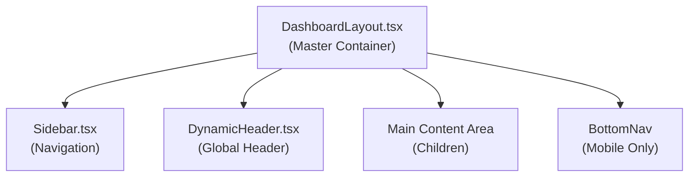
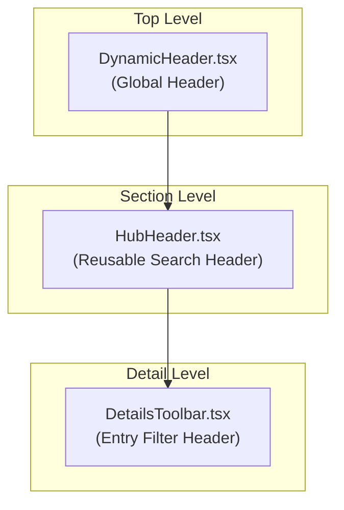
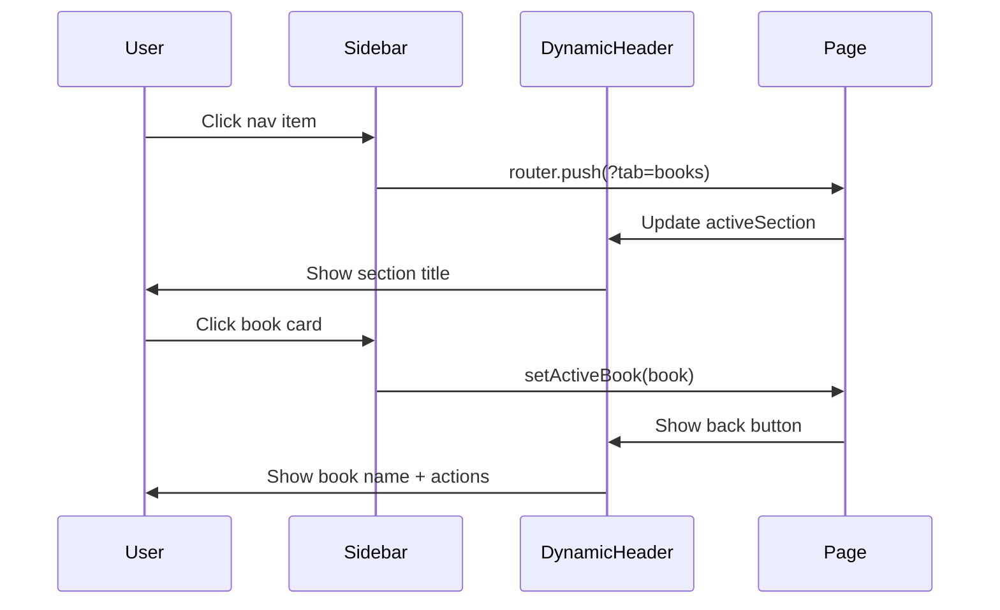

# Layout & Navigation Architecture
## Vault Pro - Forensic Audit Report

---

## 1. Core Layout Structure

### 1.1 DashboardLayout - The Master Container

**File**: [`components/Layout/DashboardLayout.tsx`](components/Layout/DashboardLayout.tsx)

The `DashboardLayout` is the **root container** that orchestrates the entire app layout:



**Responsive Grid Structure**:
- **Mobile**: Single column, stacked layout with BottomNav
- **Desktop**: 2-column grid (px sidebar + flexible content)

```typescript
// Current implementation280 (Tailwind)
className="min-h-screen bg-[var(--bg-app)] flex flex-col md:grid md:grid-cols-[280px_1fr] md:grid-rows-[auto_1fr]"
```

---

## 2. Sidebar Navigation

### 2.1 File: [`components/Layout/Sidebar.tsx`](components/Layout/Sidebar.tsx)

**Responsibilities**:
- Desktop navigation with 4 main sections
- Collapsible state (280px expanded → 90px collapsed)
- Mobile drawer with backdrop overlay

### 2.2 Navigation Items

| ID | Route | Translation Key | Icon |
|----|-------|----------------|------|
| `books` | `?tab=books` | `nav_dashboard` | Book |
| `reports` | `?tab=reports` | `nav_analytics` | BarChart2 |
| `timeline` | `?tab=timeline` | `nav_timeline` | History |
| `settings` | `?tab=settings` | `nav_system` | Settings |

### 2.3 Collapse Behavior

```typescript
// Animation variants
const sidebarVariants = {
    expanded: { width: 280 },
    collapsed: { width: 90 },
    mobileOpen: { x: 0 },
    mobileClosed: { x: -320 }
};
```

### 2.4 Responsive Physics

| Breakpoint | Sidebar Behavior |
|------------|------------------|
| **Mobile** (<768px) | Hidden, replaced by BottomNav drawer |
| **Desktop** (≥768px) | Visible, collapsible via chevron button |

---

## 3. The "3 Headers" Mystery - Explained in Bengali

### ৩টি হেডার কেন আছে?

Vault Pro তে **৩টি আলাদা Header component** আছে কারণ প্রতিটি **ভিন্ন context** এবং **ভিন্ন responsibility** সামলায়:



---

### 3.1 DynamicHeader.tsx - The Global OS Header

**File**: [`components/Layout/DynamicHeader.tsx`](components/Layout/DynamicHeader.tsx)

**কেন এটি আছে?** 
এটি **app-level global header** যা সব পেজে একই থাকে। এটে:
- Theme toggle
- User profile menu  
- Back button (when book is active)
- Book-specific actions (share, export, analytics)

**When Used**:
- Always visible at top of DashboardLayout
- Sticky position with backdrop blur

**Internal Logic**:
```typescript
// Conditional rendering based on activeBook
{isBookActive ? (
    // Book View: Show back button + book name + actions
    <motion.div key="book-title">
        <Tooltip text={t('tt_back_dashboard')}>
            <SafeButton onAction={() => setActiveBook(null)}>
                <ChevronLeft />
            </SafeButton>
        </Tooltip>
        <h2>{activeBook?.name}</h2>
    </motion.div>
) : (
    // Dashboard View: Show section title + date
    <motion.div key="global-title">
        <h2>{t('financial_dashboard')}</h2>
        <p>{new Date().toLocaleDateString()}</p>
    </motion.div>
)}
```

---

### 3.2 HubHeader.tsx - The Search & Filter Header

**File**: [`components/Layout/HubHeader.tsx`](components/Layout/HubHeader.tsx)

**কেন এটি আছে?**
এটি একটি **reusable component** যা search এবং sort functionality সরবরাহ করে। এটি section-level ব্যবহৃত হয়।

**When Used**:
1. **BooksSection** (Dashboard) - Book search & sort
2. **DetailsToolbar** (Ledger View) - Entry search & sort

**Props Interface**:
```typescript
interface HubHeaderProps {
    title: string;           // Section title
    subtitle: string;        // Subtitle text
    icon: LucideIcon;        // Icon component
    searchQuery?: string;
    onSearchChange?: (val: string) => void;
    sortOption?: string;
    sortOptions?: string[];
    onSortChange?: (val: string) => void;
    hideIdentity?: boolean;   // Hide left identity section
    fullWidthSearch?: boolean;
}
```

**Key Features**:
- **Morphic Search**: Mobile search animates from icon to input
- **Apple-style Sort Menu**: Dropdown with animated selection
- **Sticky positioning**: Stays at top on scroll

---

### 3.3 DetailsToolbar.tsx - The Ledger Control Hub

**File**: [`components/Sections/Books/DetailsToolbar.tsx`](components/Sections/Books/DetailsToolbar.tsx)

**কেন এটি আছে?**
এটি **Book Details page এর জন্য specialized header** যা entries এর:
- Search
- Sort (Date/Amount/Title)
- Category Filter

**Actually uses HubHeader internally**:
```typescript
<HubHeader
    title={t('ledger_live_feed')}
    subtitle={`${entryCount} ${t('units_secured')}`}
    icon={Zap}
    searchQuery={entrySearchQuery}
    onSearchChange={setEntrySearchQuery}
    sortOption={getSortOption()}
    sortOptions={['Date', 'Amount', 'Title']}
    onSortChange={handleSortChange}
    hideIdentity={true}
    fullWidthSearch={true}
>
    {/* Mobile Filter + Category Menu */}
</HubHeader>
```

---

## 4. Page-to-Header Mapping

### কোন পেজে কোনটি ব্যবহৃত হয়?

| Page/View | DynamicHeader | HubHeader | DetailsToolbar |
|-----------|---------------|-----------|----------------|
| **Dashboard** (Books list) | ✅ Always | ✅ BooksSection | ❌ |
| **Book Details** (Ledger) | ✅ With back btn | ❌ | ✅ DetailsToolbar |
| **Reports** | ✅ Always | ✅ ReportsSection | ❌ |
| **Timeline** | ✅ Always | ✅ TimelineSection | ❌ |
| **Settings** | ✅ Always | ❌ | ❌ |

---

## 5. Bengali Explanation: Header Architecture

### ৫.১ কেন ৩টি হেডার?

```
┌─────────────────────────────────────────────────────────┐
│                    DynamicHeader                       │
│         (Theme, Profile, Back Button, Actions)         │
├─────────────────────────────────────────────────────────┤
│                                                         │
│   ┌───────────────────────────────────────────────┐   │
│   │              HubHeader / DetailsToolbar        │   │
│   │         (Search, Sort, Filter Controls)        │   │
│   └───────────────────────────────────────────────┘   │
│                                                         │
│   ┌───────────────────────────────────────────────┐   │
│   │                   Content                      │   │
│   │              (Books/Entries/Stats)            │   │
│   └───────────────────────────────────────────────┘   │
│                                                         │
└─────────────────────────────────────────────────────────┘
```

**বাংলা ব্যাখ্যা:**

1. **DynamicHeader**: এটা হলো "OS Level" header - অর্থাৎ app এর সব পেজে একই থাকে। এটা user profile, theme toggle, এবং global actions (share, export) সামলায়।

2. **HubHeader**: এটা হলো "Section Level" header - যেকোন page যেখানে search/sort দরকার সেখানে ব্যবহার হয়। এটা reusable কারণ BooksSection এবং DetailsToolbar দুটোই এটা ব্যবহার করে।

3. **DetailsToolbar**: এটা হলো "Detail Level" header - শুধুমাত্র Book Details (Ledger) page এ ব্যবহার হয়। এটা HubHeader এর specialized version যাতে entry-specific filters (category, search, sort) আছে।

### ৫.২ Internal Logic Flow

```typescript
// DynamicHeader - Conditional rendering
if (activeBook) {
    // Book View: Show book name + back button + actions
    <div>
        <BackButton />
        <h2>{activeBook.name}</h2>
        <ShareButton />
        <ExportButton />
    </div>
} else {
    // Dashboard: Show section title
    <div>
        <h2>{t('financial_dashboard')}</h2>
    </div>
}
```

---

## 6. Responsive Physics Audit

### 6.1 Sidebar Collapse

| State | Width | Animation | Mobile |
|-------|-------|-----------|--------|
| **Expanded** | 280px | Spring | ❌ |
| **Collapsed** | 90px | Spring | ❌ |
| **Mobile Open** | 280px | Slide from left | ✅ |
| **Mobile Closed** | -320px | Slide off-screen | ✅ |

### 6.2 Mobile Bottom Navigation

Instead of sidebar, mobile uses **BottomNav** (defined in DashboardLayout):

```typescript
// Mobile-only, appears at bottom
<motion.div className="md:hidden fixed bottom-6 left-4 right-4 z-[900]">
    <div className="h-[72px] rounded-[35px] flex items-center justify-between">
        <NavIcon id="books" />
        <NavIcon id="reports" />
        <FabButton (Add) />
        <NavIcon id="timeline" />
        <NavIcon id="settings" />
    </div>
</motion.div>
```

### 6.3 Header Height Adaptation

| Device | DynamicHeader Height | Animation |
|--------|---------------------|-----------|
| **Mobile** | 96px (h-24) | Scroll-triggered shadow |
| **Desktop** | 80px (h-20) | Scroll-triggered shadow |

---

## 7. Navigation Flow



---

## 8. Summary

| Component | File | Responsibility | Scope |
|-----------|------|----------------|-------|
| **DashboardLayout** | DashboardLayout.tsx | Master container, grid layout | App-wide |
| **Sidebar** | Sidebar.tsx | Navigation, collapse, mobile drawer | App-wide |
| **DynamicHeader** | DynamicHeader.tsx | Global actions, theme, profile | App-wide |
| **HubHeader** | HubHeader.tsx | Search, sort, reusable | Section-wide |
| **DetailsToolbar** | DetailsToolbar.tsx | Entry filter, uses HubHeader | Book details |

---

*Generated: 2026-03-11*
*Vault Pro - Layout & Navigation Audit*
