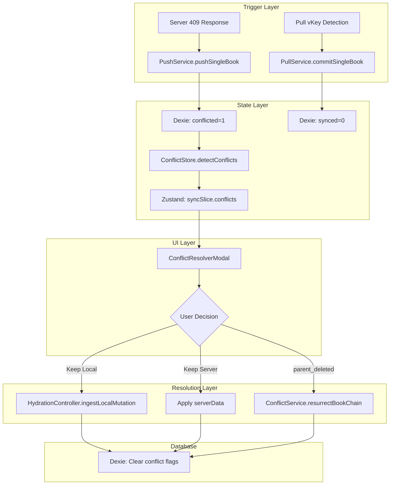

# CONFLICT SYSTEM FORENSIC AUDIT REPORT

**Project**: Vault Pro - Enterprise Offline-First Cash-Book System  
**Audit Type**: Forensic Architectural Analysis  
**Date**: 2026-03-11  
**Status**: PATHOR-STANDARD (Read-Only Audit)  
**Auditor**: Kilo Code, Elite Master System Architect

---

## EXECUTIVE SUMMARY

A sophisticated, multi-layered Conflict Resolution System already exists in the Vault Pro codebase. The system handles:

1. **Version Conflicts** (VERSION_CONFLICT) - When local and server versions diverge
2. **Parent-Deleted Scenarios** (PARENT_DELETED_CHILDREN_EXIST) - When parent book is deleted remotely but has local children

**Critical Discovery**: The `parent_deleted` infrastructure is partially implemented but appears **NOT actively triggered** in the current codebase.

---

## 1. CONFLICT TRIGGER MECHANISMS

### 1.1 PushService - HTTP 409 Conflict Response

**File**: `lib/vault/services/PushService.ts`

**Books** (Lines 1655-1727):
```typescript
} else if (res.status === 409) {
  // 🚨 CONFLICT HANDLING
  const conflictData = await res.json();
  
  // Standard conflict handling for non-deleted books
  const conflictedRecord = normalizeRecord({
    ...book,
    conflicted: 1,
    conflictReason: 'VERSION_CONFLICT',
    serverData: conflictData,
    synced: 0
  }, this.userId);
  
  await db.books.update(book.localId!, conflictedRecord);
}
```

**Entries** (Lines 1881-1953):
- Identical pattern: sets `conflicted: 1`, `conflictReason: 'VERSION_CONFLICT'`
- Preserves server's conflicting data in `serverData` field

### 1.2 PullService - vKey-Based Conflict Detection

**File**: `lib/vault/services/PullService.ts`

**Lines 958-993** (Books) and **1081-1114** (Entries):
```typescript
// 🎯 PRECISION SYNC: Enhanced conflict detection with vKey guard
const localVKey = existing.vKey || 0;
const serverVKey = book.vKey || 0;

// 2. LOCAL NEWER CHECK: Push back to server
if (localTime > serverTime) {
  // vKey CONFLICT GUARD: Use vKey as secondary conflict detection
  if (localVKey > serverVKey) {
    console.log(`🔄 [PRECISION SYNC] Book ${book.cid} local is newer...`);
    await db.books.update(existing.localId!, { synced: 0 });
    window.dispatchEvent(new CustomEvent('sync-request'));
  }
}
```

**Note**: PullService uses **vKey as a guard** but does NOT set `conflicted: 1` flag - it only marks for re-push.

---

## 2. STATE MANAGEMENT LAYERS

### 2.1 ConflictStore (Zustand)

**File**: `lib/vault/ConflictStore.ts`

```typescript
// Detect conflicts from Dexie
detectConflicts: async () => {
  const conflictedBooks = await db.books.where('conflicted').equals(1).toArray();
  const conflictedEntries = await db.entries.where('conflicted').equals(1).toArray();
  
  const mappedConflicts = [
    ...conflictedBooks.map((book) => ({
      type: 'book' as const,
      cid: book.cid,
      localId: book.localId,
      record: book,
      conflictType: mapConflictType(book.conflictReason || 'VERSION_CONFLICT'),
      icon: Book
    })),
    // ... same for entries
  ];
  
  set({ conflicts: mappedConflicts });
}
```

### 2.2 syncSlice (VaultStore)

**File**: `lib/vault/store/slices/syncSlice.ts`

```typescript
// Register conflict in state
registerConflict: (conflict) => {
  set((state) => {
    const conflicts = state.conflicts || [];
    const conflictWithId = {
      ...conflict,
      id: conflict.id || conflict.cid,
      serverData: conflict.serverData || conflict.record?.serverData
    };
    const exists = conflicts.some((c) => c.id === conflictWithId.id);
    if (!exists) conflicts.push(conflictWithId);
    state.conflicts = conflicts;
  });
}

// Resolve conflict (remove from state)
resolveConflict: (id) => {
  set((state) => {
    state.conflicts = state.conflicts.filter((c) => c.id !== id);
  });
}
```

---

## 3. UI ISLAND - CONFLICT RESOLVER MODAL

**File**: `components/Modals/ConflictResolverModal.tsx` (407 lines)

### Features:
1. **Side-by-Side Comparison**:
   - Left: "Your Version" (Blue theme - `bg-blue-500/20`)
   - Right: "Server Version" (Green theme - `bg-green-500/20`)

2. **Conflict Type Handling**:
   - `version` - Standard field-level diff display
   - `parent_deleted` - Special warning UI with child count

3. **Resolution Actions**:
   ```typescript
   // For parent_deleted + local resolution
   if (conflictType === 'parent_deleted' && resolution === 'local') {
     await resurrectBookChain(record.cid);  // Full chain resurrection
   }
   
   // For standard version conflicts
   registerConflict(conflictItem);
   onResolve(resolution);  // 'local' or 'server'
   ```

---

## 4. RESOLUTION FLOWS

### 4.1 For Entries (via ConflictService)

**File**: `lib/vault/services/ConflictService.ts`

```typescript
async resolveEntryConflict(entryCid: string, get: any) {
  // Find parent book
  const book = await db.books.where('cid').equals(entry.bookId).first();
  
  // Update parent book for re-sync
  if (book.synced === 1) {
    const updatedBook = {
      ...book,
      vKey: (book.vKey || 0) + 1,
      synced: 0,
      conflicted: 0,
      conflictReason: '',
      updatedAt: getTimestamp()
    };
    await controller.ingestLocalMutation('BOOK', [updatedBook]);
  }
  
  // Trigger sync
  const { triggerManualSync } = get();
  await triggerManualSync();
}
```

### 4.2 For Books (via HydrationController)

**File**: `lib/vault/ConflictStore.ts`

```typescript
async executeSingleResolution(item: ConflictItem, resolution: 'local' | 'server') {
  if (resolution === 'server') {
    await get().createSafetySnapshot(item);  // Backup before overwrite
  }
  
  const updateData = resolution === 'local' 
    ? { conflicted: 0, synced: 0, serverData: null, vKey: item.record.vKey + 1 }
    : { ...item.record.serverData, conflicted: 0, synced: 1, serverData: null };
  
  await controller.ingestLocalMutation(item.type.toUpperCase(), [{ ...item.record, ...updateData }]);
}
```

### 4.3 For parent_deleted (Chain Resurrection)

**File**: `lib/vault/services/ConflictService.ts`

```typescript
async resurrectBookChain(bookCid: string) {
  const book = await db.books.where('cid').equals(bookCid).first();
  
  // Clear server identity
  const resurrectedBook = {
    ...book,
    _id: undefined,  // Remove server ID
    vKey: (book.vKey || 0) + 1,
    synced: 0,
    conflicted: 0,
    conflictReason: '',
    serverData: null,
    updatedAt: getTimestamp()
  };
  
  // Update book
  await controller.ingestLocalMutation('BOOK', [resurrectedBook]);
  
  // Find and reset ALL entries under this book
  const allEntries = await db.entries
    .where('bookId').equals(bookCid)
    .and((entry) => entry.isDeleted === 0)
    .toArray();
  
  const entryUpdates = allEntries.map((entry) => ({
    ...entry,
    synced: 0,
    vKey: (entry.vKey || 0) + 1,
    updatedAt: getTimestamp()
  }));
  
  await controller.ingestLocalMutation('ENTRY', entryUpdates);
}
```

---

## 5. DATABASE SCHEMA

**File**: `lib/offlineDB.ts`

```typescript
// Books table fields (lines 46-77)
interface LocalBook {
  conflicted?: 0 | 1;      // Conflict flag
  conflictReason?: string; // 'VERSION_CONFLICT' | 'PARENT_DELETED_CHILDREN_EXIST'
  serverData?: any;         // Server's conflicting version
  vKey: number;             // Version key for conflict detection
  synced: 0 | 1;
  updatedAt: number;
}

// Entries table fields (lines 79-112)
interface LocalEntry {
  conflicted?: 0 | 1;
  conflictReason?: string;
  serverData?: any;
  vKey: number;
  synced: 0 | 1;
  updatedAt: number;
}
```

---

## 6. CROSS-FILE DEPENDENCY MAP



---

## 7. CRITICAL DISCOVERY: PARENT_DELETED GAP

### What Exists:
- ✅ `ConflictMapper.mapConflictType('PARENT_DELETED_CHILDREN_EXIST')` → `'parent_deleted'`
- ✅ `ConflictService.resurrectBookChain()` - Full chain resurrection logic
- ✅ `ConflictResolverModal` - Special UI for parent_deleted warnings
- ✅ Database schema supports `conflictReason: 'PARENT_DELETED_CHILDREN_EXIST'`

### What's Missing:
- ❌ **NO TRIGGER FOUND** in PushService for detecting parent deletion
- ❌ **NO 404 HANDLING** in PushService that sets `conflictReason: 'PARENT_DELETED_CHILDREN_EXIST'`
- The system expects server to return 409 with specific error, but there's no explicit 404→parent_deleted conversion

### Hypothesis:
The `parent_deleted` conflict may have been designed for a future scenario where:
1. User tries to push an entry
2. Server returns 404 (book not found)
3. Client detects "parent deleted with children" scenario

**But this trigger is not currently implemented.**

---

## 8. RECOMMENDATIONS

### Option A: Enhance Existing System (Recommended)
Instead of creating a separate Ghost Detection, leverage the existing conflict infrastructure:

1. **Add parent_deleted trigger** in PushService:
   - When pushing entry fails with 404 (parent not found)
   - Check if local has children for that parent
   - Set `conflictReason: 'PARENT_DELETED_CHILDREN_EXIST'`

2. **Add Ghost Detection as conflict detection**:
   - After pull, query: local has `synced: 1` but CID not in server response
   - Convert to `conflicted: 1` with special `conflictReason: 'GHOST_RECORD'`

### Option B: Keep Separate (Simpler but Duplicative)
Continue with the Ghost Detection implementation as separate from conflict system:
- Mark ghosts as `isDeleted: 1` instead of creating conflicts
- Simpler but loses the rich conflict resolution UI

---

## 9. FILE REFERENCE INDEX

| Layer | File | Key Lines | Purpose |
|-------|------|-----------|---------|
| Schema | `lib/offlineDB.ts` | 46-77, 79-112 | `conflicted`, `conflictReason`, `serverData` fields |
| Detection | `lib/vault/ConflictStore.ts` | 120-148 | `detectConflicts()` queries Dexie |
| Resolution | `lib/vault/services/ConflictService.ts` | 42-115, 126-183 | `resurrectBookChain()`, `resolveEntryConflict()` |
| Push Trigger | `lib/vault/services/PushService.ts` | 1655-1727, 1881-1953 | HTTP 409 handling, `conflicted: 1` |
| Pull Guard | `lib/vault/services/PullService.ts` | 958-993 | vKey conflict detection |
| State | `lib/vault/store/slices/syncSlice.ts` | 289-328 | `registerConflict()`, `resolveConflict()` |
| UI | `components/Modals/ConflictResolverModal.tsx` | 1-407 | Side-by-side comparison modal |
| Mapper | `lib/vault/ConflictMapper.ts` | 43-70 | Conflict type mapping |

---

## CONCLUSION

The Vault Pro system has a **production-ready conflict resolution infrastructure** that handles:
- Version conflicts via HTTP 409 responses
- Field-level diff comparison in modal UI  
- Both "Keep Local" and "Keep Server" resolution paths
- Parent-child chain resurrection for deleted parents

The main gap is the **parent_deleted trigger mechanism** - the code exists to handle it but it's not actively triggered.

**Recommendation**: Before implementing Ghost Detection, discuss with Lead Architect whether to:
1. Extend the existing conflict system to handle ghosts
2. Or proceed with simpler separate ghost handling

---

*Report Generated: 2026-03-11*  
*Protocol: FORENSIC ARCHITECTURAL AUDIT*  
*Standard: PATHOR (Stone Solid)*
