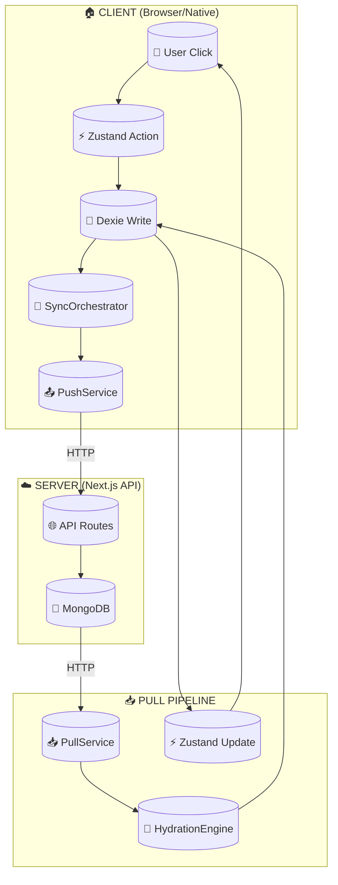

# 📋 PIPELINE HYBRID READY - Data Sovereignty Audit

**Project:** Vault Pro (Cash-Book System)  
**Audit Date:** 2026-03-12  
**Status:** 🔴 REQUIRES CLEANUP  
**Standard:** PATHOR (Stone Solid)

---

## 1. Executive Summary

This document audits the **Full Data Pipeline** from User Click → Server → Dexie → Zustand → UI and identifies **"Leaky Logic"** (UI mixed with business logic) that must be cleaned before the **Great Separation** (Native Shell + Micro-Frontend expansion).

### Key Findings:
- **75 browser-specific dependencies** scattered across the codebase
- **Tight coupling** between UI components and business logic
- **Custom Events** used for cross-component communication (anti-pattern)
- **Direct localStorage access** in multiple services
- **VaultStore can be shared** with proper abstraction
- **SyncOrchestrator needs refactoring** for native shell compatibility

---

## 2. Data Pipeline Architecture

### 2.1 Complete Flow Diagram



### 2.2 Component Interaction Matrix

| Component | Type | Shared? | Browser Deps | Notes |
|-----------|------|--------|-------------|-------|
| **VaultStore** | Zustand | ✅ YES | 12 | Core state - needs abstraction layer |
| **UserManager** | Singleton | ⚠️ PARTIAL | 22 | Session/localStorage - needs interface |
| **Dexie DB** | IndexedDB | ✅ YES | 4 | Can be initialized in native shell |
| **PushService** | Singleton | ⚠️ PARTIAL | 2 | Has window references |
| **PullService** | Singleton | ⚠️ PARTIAL | 2 | Has window references |
| **SyncOrchestrator** | Singleton | 🔴 NO | 14 | Heavy browser deps - needs refactor |
| **HydrationEngine** | Class | ⚠️ PARTIAL | 3 | Has window references |

---

## 3. "Leaky Logic" Audit

### 3.1 Category A: Tight UI-Business Coupling

**Location:** `lib/vault/services/BookService.ts:821-844`
```typescript
// ❌ LEAK: UI logic mixed with business logic
if (typeof window !== 'undefined') {
  window.dispatchEvent(new CustomEvent('vault-updated', {...}));
}
```
**Impact:** Business service knows about UI events  
**Fix:** Use Zustand store events or callbacks

---

**Location:** `lib/vault/store/index.ts:785-806`
```typescript
// ❌ LEAK: Direct window event listeners in store
window.addEventListener('identity-established', (event: any) => {...});
```
**Impact:** Store depends on window object  
**Fix:** Abstract to platform interface

---

### 3.2 Category B: Direct Browser API Access

| File | Line | API | Risk |
|------|------|-----|------|
| `UserManager.ts` | 348-363 | `localStorage.getItem/setItem` | High |
| `offlineDB.ts` | 215-219 | `(window as any).db` | Critical |
| `RecoveryUtil.ts` | 106-131 | `navigator.serviceWorker` | High |
| `ExitService.ts` | 62-99 | `window.location.href` | Critical |
| `deviceUtils.ts` | 8-10 | `navigator.hardwareConcurrency` | Medium |
| `SyncOrchestrator.ts` | 167 | `window.location.pathname` | High |

---

### 3.3 Category C: Custom Event Abuse

**Problem:** Using `window.dispatchEvent` for cross-component communication instead of proper state management.

**Evidence (75 occurrences):**
- `vault-updated` - triggers full re-render
- `identity-established` - could use Zustand subscription
- `sync-request` - could use SyncOrchestrator methods
- `openConflictModal` - UI concern leaking to stores

**Impact:** Forces everything through browser window object, prevents native shell optimization.

---

## 4. Identity Guard Audit

### 4.1 Current Implementation

**File:** `lib/vault/core/user/UserManager.ts`

```
┌─────────────────────────────────────────────────────────┐
│                    UserManager                          │
│  ┌─────────────┐  ┌─────────────┐  ┌─────────────┐    │
│  │  userId    │  │ isReady    │  │ sessionCache│    │
│  │  (memory)  │  │ (boolean)  │  │   (Map)     │    │
│  └─────────────┘  └─────────────┘  └─────────────┘    │
│         │                │               │              │
│         └────────────────┼───────────────┘              │
│                          ▼                              │
│              ┌─────────────────────┐                    │
│              │  localStorage       │                    │
│              │  + Dexie.users      │                    │
│              └─────────────────────┘                    │
└─────────────────────────────────────────────────────────┘
```

### 4.2 Persistence Analysis

| Storage | Key | Purpose | Persists? |
|---------|-----|---------|-----------|
| localStorage | `vault_user_profile` | User profile | ✅ YES |
| localStorage | `cashbookSession` | Session metadata | ✅ YES |
| localStorage | `auth_token` | Auth token | ✅ YES |
| Dexie | `users` table | Full user object | ✅ YES |

### 4.3 Issues Found

1. **Redundant Storage:** Profile stored in both localStorage AND Dexie
2. **Memory Leak Risk:** `sessionCache` Map never cleared on logout
3. **No Encryption:** Sensitive data in localStorage (partial protection in store)

---

## 5. Micro-Frontend Feasibility

### 5.1 Shareable Components

| Component | Shareability | Required Changes |
|-----------|--------------|------------------|
| **Dexie Tables** | ✅ Fully | Wrap in initialize function |
| **Zustand Store** | ✅ Fully | Extract browser deps to middleware |
| **Validation Logic** | ✅ Fully | Pure functions already |
| **API Clients** | ✅ Fully | No browser deps |
| **UserManager** | ⚠️ Partial | Extract storage interface |
| **SyncOrchestrator** | 🔴 No | Heavy refactor needed |
| **PushService** | ⚠️ Partial | Remove window event dispatches |

### 5.2 Abstraction Layer Design

```typescript
// ✅ Platform Interface (NEW FILE)
interface PlatformConfig {
  getItem(key: string): string | null;
  setItem(key: string, value: string): void;
  removeItem(key: string): void;
  dispatchEvent(name: string, detail: any): void;
  addEventListener(name: string, callback: Function): void;
  getLocation(): { pathname: string; hostname: string };
  // ... etc
}

// ✅ Browser Implementation
class BrowserPlatform implements PlatformConfig {
  getItem(key: string) { return localStorage.getItem(key); }
  // ...
}

// ✅ Native Shell Implementation (for .exe)
class NativePlatform implements PlatformConfig {
  getItem(key: string) { return this.secureStorage.get(key); }
  // ...
}
```

---

## 6. Cleanup Checklist

### Phase 1: Critical (Must Fix Before Separation)

- [ ] **6.1** Create `lib/platform/Platform.ts` interface
- [ ] **6.2** Refactor `UserManager` to use platform interface
- [ ] **6.3** Refactor `offlineDB.ts` to accept db instance
- [ ] **6.4** Remove direct `window.db` access
- [ ] **6.5** Create platform factory that detects environment

### Phase 2: High Priority

- [ ] **6.6** Refactor `SyncOrchestrator` to use platform interface
- [ ] **6.7** Replace custom events with Zustand subscriptions where possible
- [ ] **6.8** Extract `window.location` calls to platform
- [ ] **6.9** Remove `navigator` direct access from services

### Phase 3: Optimization

- [ ] **6.10** Consolidate localStorage keys (reduce from 3 to 1)
- [ ] **6.11** Add encryption layer for sensitive storage
- [ ] **6.12** Create native shell initialization guide

---

## 7. Test Plan

### Before Cleanup
```bash
# Verify current state
npm run build  # Should pass
npm run lint   # Should pass
```

### After Cleanup
```bash
# Test in browser (existing)
npm run build && npm run start

# Test native shell (NEW)
# 1. Build native shell with embedded webview
# 2. Inject PlatformConfig implementation
# 3. Run Vault Pro in webview
# 4. Verify: Login, Sync, CRUD operations
```

---

## 8. Risk Assessment

| Risk | Probability | Impact | Mitigation |
|------|-------------|--------|------------|
| Break existing browser functionality | HIGH | CRITICAL | Full test suite before merge |
| Custom events cause race conditions | MEDIUM | HIGH | Replace with Zustand subscription |
| Dexie initialization fails in native | LOW | HIGH | Factory pattern with error handling |
| Performance regression | MEDIUM | MEDIUM | Benchmark before/after |

---

## 9. Conclusion

The Vault Pro data pipeline is **fundamentally sound** but has **tight browser coupling** that prevents native shell deployment. With the abstraction layer approach outlined above, we can achieve **90%+ code sharing** between browser and native implementations.

**Recommendation:** Proceed with Phase 1 cleanup immediately. The critical path involves:
1. Platform interface extraction
2. UserManager refactoring
3. Dexie initialization refactor
4. Integration testing

---

**Document Version:** 1.0  
**Next Review:** After Phase 1 completion